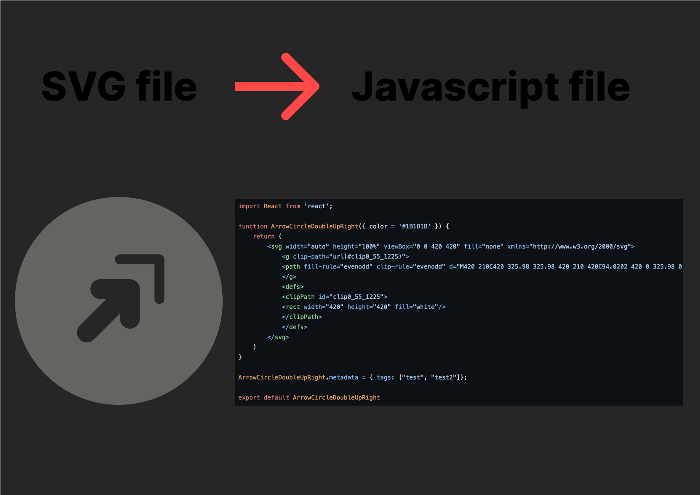

# Script Plugin Hieroglyphs.io

[](LICENSE)

This program allows me to transform a static SVG image into a javascript function allowing it to be dynamically editable.   

## Description  

For my project X I had to simplify the creation process as much as possible. This program allows me to transform my SVG creations into a Javascript function that can easily be modified by the user using my npm plugin. This is a python program that retrieves SVG image data and integrates it into a javascript function by adding customizable elements and dimensions that can easily be integrated into a project.  



## Table of Contents

- [Getting Started](#Getting-Started)
- [Launch Application](#Launch-Application)
- [Contributing](#Contributing)
- [License](#License)  

## Getting Started  

```bash
git clone https://github.com/HaDock404/script-plugin-hieroglyphs.git
cd script-plugin-hieroglyphs
pip install -r ./packages/requirements.txt
```  

## Lauch Application  

Put SVG files in SVG folder and do:  

```bash
python script.py
```  

## Contributing

Pull requests are welcome. For major changes, please open an issue first
to discuss what you would like to change.

Please make sure to update tests as appropriate.

## License  

This project is licensed under the MIT License - see the [LICENSE](./LICENSE) file for details.